# Office 365

## 申请方式 {#application}

理论上任何社团负责人或者在社团中负责重要项目的人员都可以申请，原则是按需分配，因为邮箱是工作工具，而不是福利资源。

同理，不再担任负责人且不再处理事务的同学使用的邮箱应该收回（见下方 [默认地址](#default-route) 一节）。

## 邮件礼仪 {#email-etiquette}

!!! note "CC（抄送）和设置回复地址的目的都是为了让所有 LUG 负责的同学可以看到事件最新的进展"

    抄送会把你发的邮件给所有的负责人；**回复地址（Reply-To）设置之后，对方就知道这是你代表 LUG 写的邮件，并且默认回复邮件的时候地址就是所有负责人的邮件列表**。所以下文中要求设置这些内容。

    如果遇到需要以私人身份，或者以其他非 LUG 代表负责人的身份回复邮件的场合，请修改回复地址信息。因为 Outlook 网页版不便于修改这些内容，建议使用邮件客户端处理。（个人推荐 ThunderBird）。

    对于需要向非邮件列表的不特定群体群发的邮件（例如通知类消息），请注意不要将所有邮箱都放在收件人里，否则**所有收到邮件的人都能看到其他收件人的邮箱（隐私问题）；并且收件人如果回复邮件不当，其他的收件人也会收到其回复**。一种方便的做法是：将所有需要收到通知的收件人放在**密送 (BCC)**一栏中，收件人填写原抄送地址。

我们加入了很多邮件列表，其中经常有各种往来邮件（特别是 CentOS mirror announcement 这个列表，已退），它们大多数不需要我们理会。

总之，不知道怎么处理的邮件不要贸然回复。如果你认为某一封邮件需要我们处理但不知道怎么处理，请转告给其他相关同学。

以下内容从 Hypercube 编写的内容中截取：

> 回复任何邮件时，请抄送 / CC（不是密送 / BCC）给原邮件的收件地址！（比如别人发到 `lug A ustc.edu.cn`，回复时也请 CC 到 `lug A ustc.edu.cn`）
>
> 请不要“只回复邮件”。如果在回复中说“我们会做某某事”，请注意除非你明确转交给了别人，这件事应当由你来完成。

### 加入 LUG @ USTC 列表 {#lug-ustc-mailing-list}

!!! note "本节需要由 Microsoft 365 的管理员操作"

邮件列表管理在 Microsoft Admin Portal 的 [Distribution list](https://admin.microsoft.com/Adminportal/Home#/groups/_/DistributionList) 页面，其中 Staff 组和 Mirrors 组的邮件地址分别是 `lug A ustc.edu.cn` 和 `mirrors A ustc.edu.cn` 的转发目标。

## 邮件签名 {#email-signature}

Outlook 无法直接通过网页端添加发件人名称、设置回复地址，因此只能通过邮件客户端进行使用。在下一章节的 Thunderbird 中进行详细阐述。

## Thunderbird 配置

### 登录 {#tb-login}

在登录时，输入了用户名、密码后，会显示无法找到对应的邮箱配置

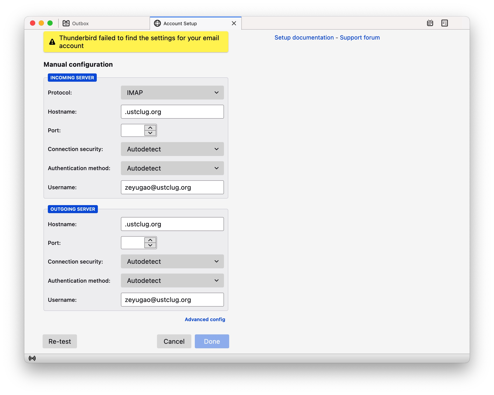

进行如下的手动配置：

- Incoming Server
    - Hostname: `outlook.office365.com`
    - Port: 993
    - Connection security: SSL/TLS
    - Authentication: Autodetect
- Outgoing server
    - Hostname: `smtp.office365.com`
    - Port: 587
    - Connection security: STARTTLS
    - Authentication: Autodetect

如下图：

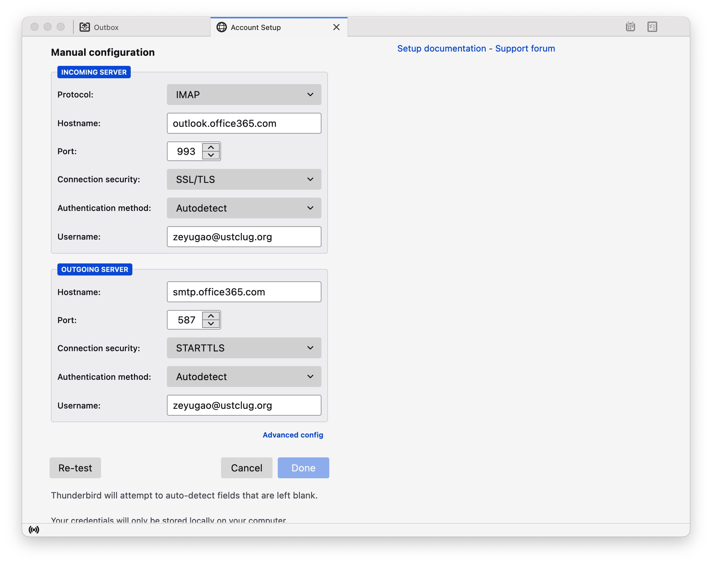

然后点左下角的 *Re-test*，重新搜索到配置后，在两个 Authentication method 中均选择 *OAuth2*。

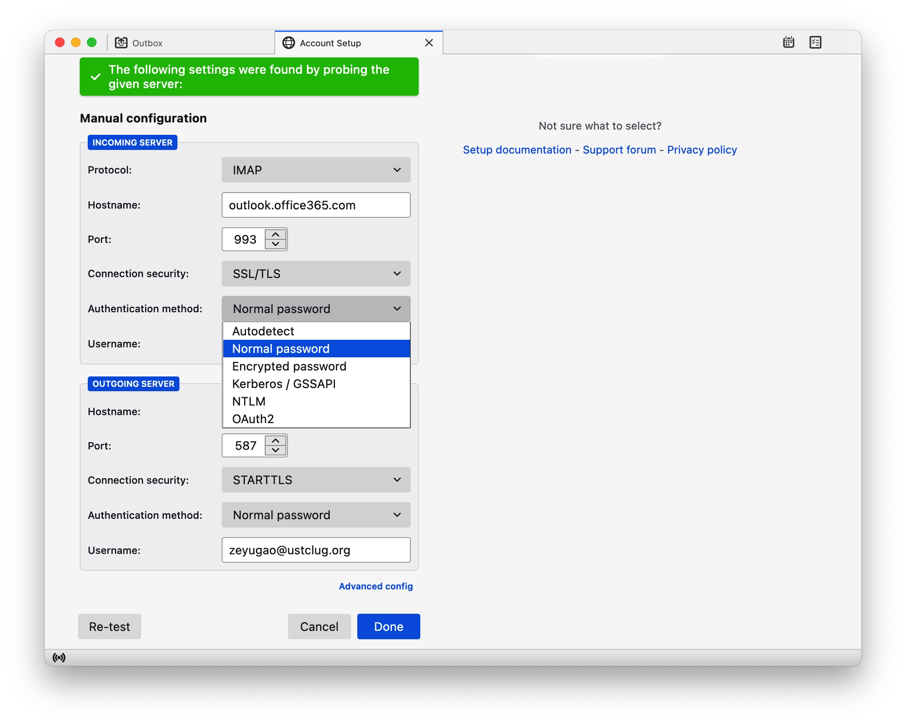

然后点 *Done*。在弹出的窗口中完成认证。

### 签名与发件身份 {#tb-signature}

在右上角中选择账户设置，在默认身份中

- 修改 *Your Name* (*您的姓名*) 为 `Zeyu Gao on behalf of USTC LUG`（请换成自己的名字）
- 修改 *Reply-to Address* (*回复地址*) 为 `lug@ustc.edu.cn`
- 修改 *Signature text* (*签名文字*) 为（最后一行换成自己的信息）

    ```text
    Linux User Group
    University of Science and Technology of China
    Homepage: https://lug.ustc.edu.cn/
    E-Mail: lug@ustc.edu.cn
    Zeyu Gao (高泽豫) <zeyugao@ustclug.org>
    ```

结果如图：

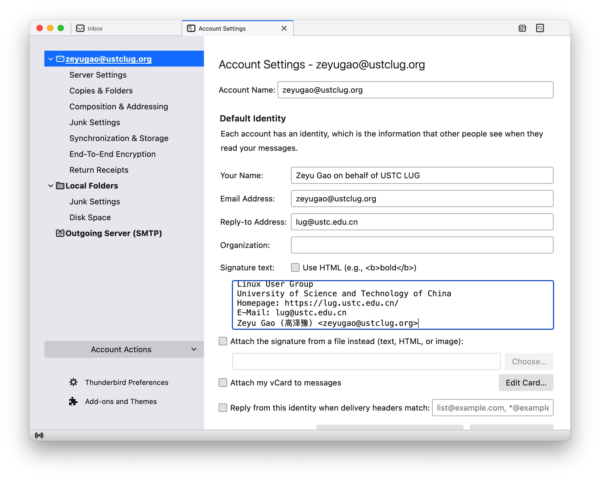

### 抄送设置 {#tb-cc}

在账户设置中，选择身份管理，点击编辑，选择 *Copies and Folders*, 启用 *Cc these email addresses*, 并输入默认抄送地址 `lug A ustc.edu.cn`

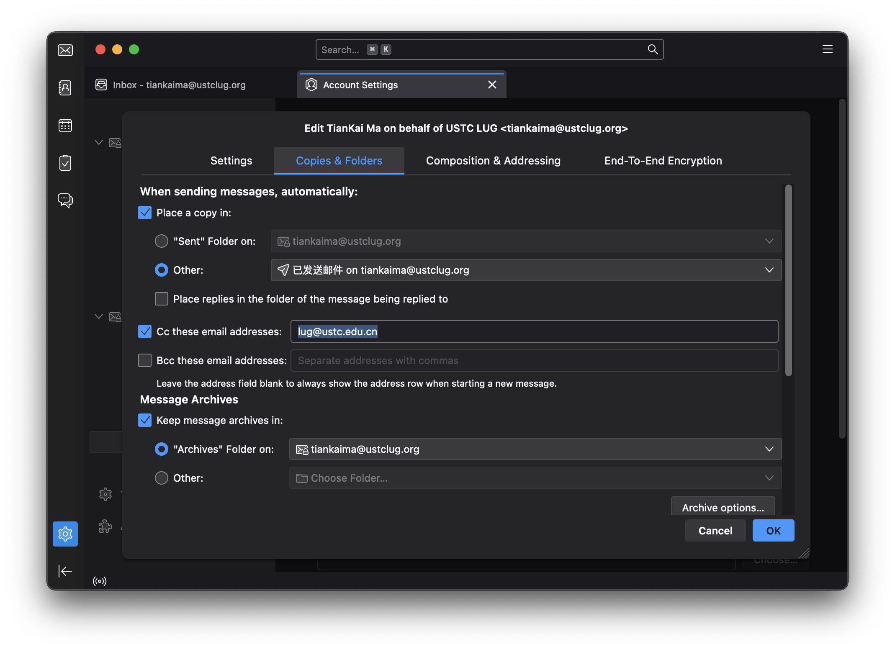

### HTML与纯文本

邮件可以以 HTML 方式编写，也可以只是纯文本内容。为了降低对方阅读出现麻烦的可能性，建议使用纯文本消息。使用纯文本消息的方法是：打开 *Thunderbird 设置* ，打开 *Account Settings* ，打开对应邮件地址下的 *Composition & Addressing* 页面，在 *Composition* 节下找到 *Compose messages in HTML format* ，将其复选框去除勾选即可。

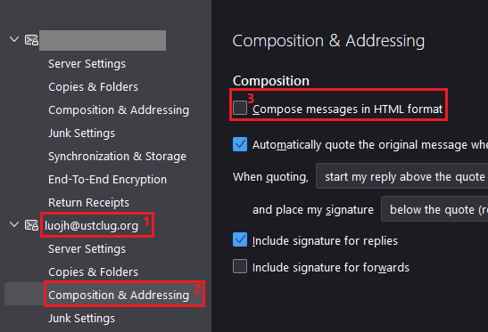

### 文件夹 {#tb-folders}

Thunderbird 维护了自己的文件夹，如果需要与云端的文件夹同步，可以进行如下操作

在账户上右键，在弹出的菜单中点击 *Subscribe*。弹出的窗口中包含了云端的文件夹，由于 Thunderbird 会自行维护垃圾箱和已发邮件，因此可能会有两个垃圾箱，*Deleted Items* 和 *Trash*，可以在网页端删除不需要的文件夹，并在 Thunderbird 中选择需要的。

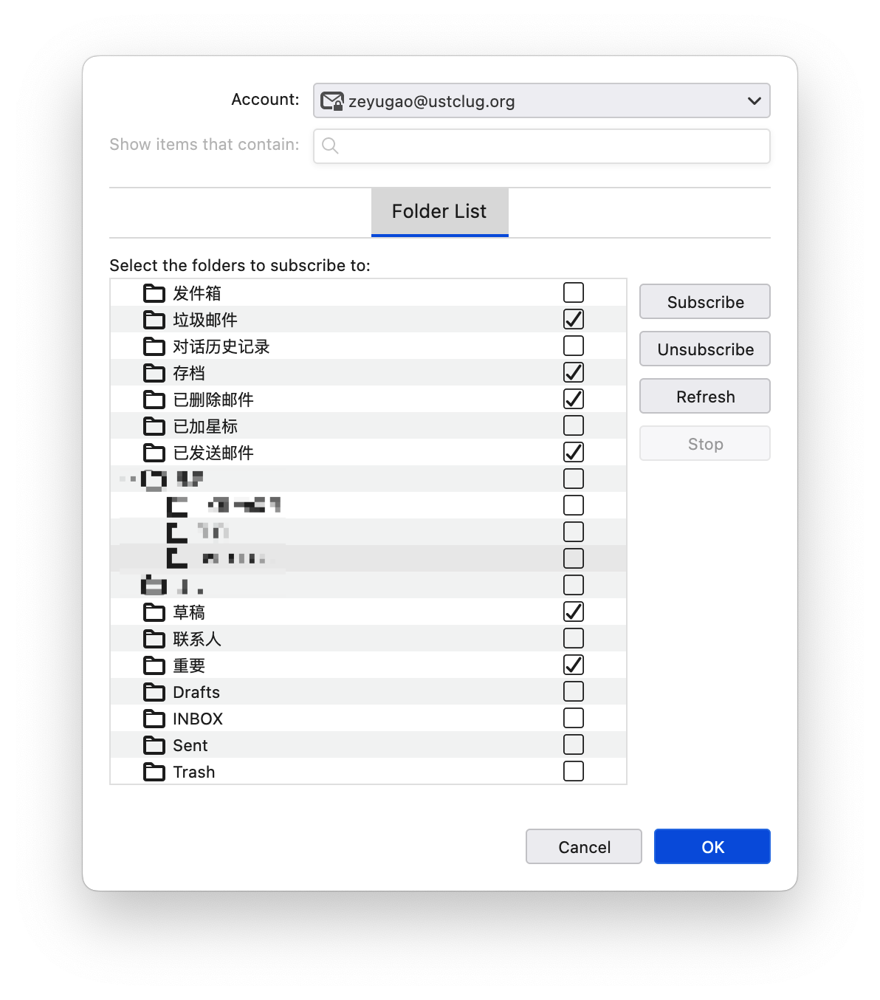

然后打开账户设置，进行如下修改

1. 在 *Server Settings* 下，修改 *When I delete a message* 为 *Move it to this folder: Deleted Items*

    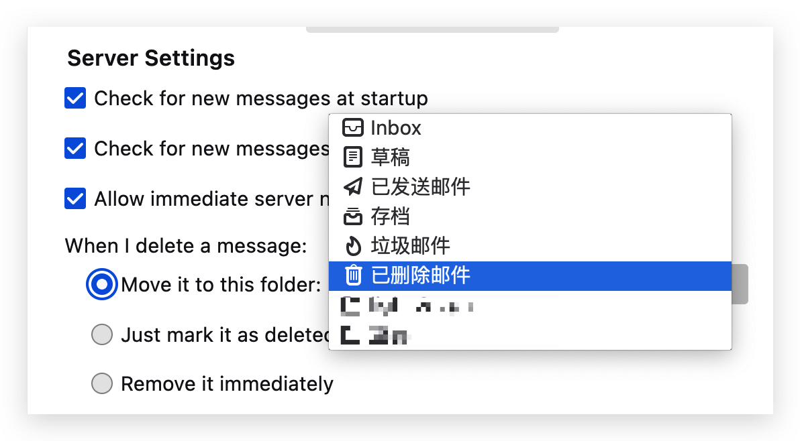

2. 在 *Copies & Folders* 下，修改 *Place a copy*、*Keep message archives in*、*Keep draft messages in* 为对应的远端服务器文件夹

    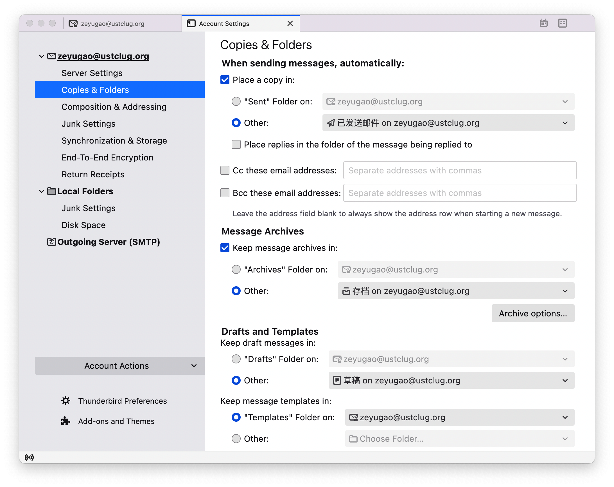

### 垃圾邮件 {#tb-junk}

Outlook 云端已经带有了垃圾邮件分类功能，不需要 Thunderbird 自己的垃圾邮件分类功能。

在账户设置的 *Local Folders* 下的 *Junk Settings* 中，取消选中 *Enable adaptive junk mail controls for this account*。

请在上面的 Subscribe 中将垃圾邮件选中以同步。此外，由于 Outlook 目前会将几乎所有邮件都扔进垃圾邮件箱（原因似乎是 M365 的机器学习模型会把所有科大的邮件扔进垃圾箱），因此设置拉取邮件时总是检查垃圾邮件箱。设置方法为在垃圾邮件目录上点击右键 → 属性，然后选择这里第二个勾：

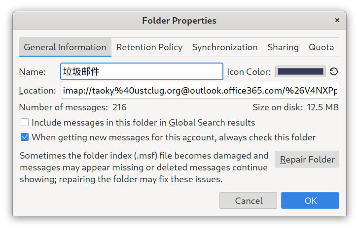

!!! warning "注意"

    不要查看垃圾邮件的远程内容。不要回复垃圾邮件。正常邮件需要手动移动到收件箱。

### 使用 Thunderbird 配置不同的身份 {#tb-profiles}

(written by taoky)

在某些情况下，需要设置新的发件人名称和回复地址（例如 hackergame staff 需要一套不同的设置）。由于 Gmail 网页端修改配置很麻烦（而且很容易忘记改回来），强烈建议使用邮件客户端。个人使用的是 Thunderbird，下面也以它为例子。

在账号加上邮箱之后，点击右键 → 属性，默认配置（LUG Staff）如图：

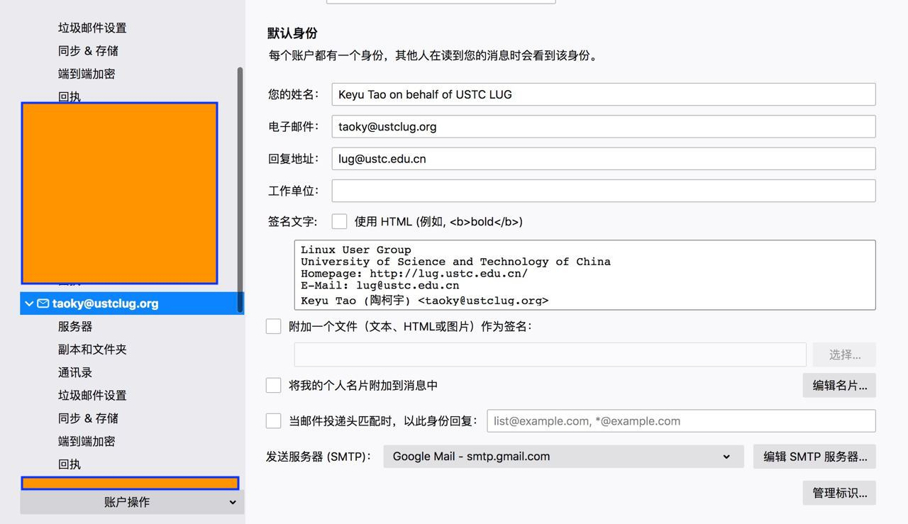

需要添加新身份时，点击右下角「管理标识」，添加对应的标识。对于 hackergame，可以配置如下：

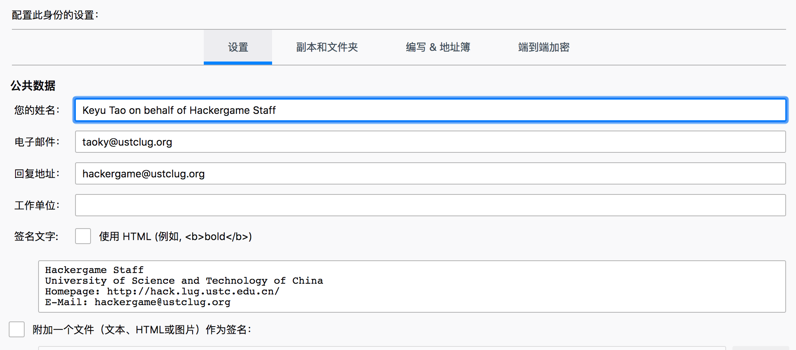

并参考[抄送设置](#tb-cc) 配置默认抄送地址 (`hackergame A ustclug.org`)

配置完成后，在编写邮件时，就可以选择新的标识了，并且发件人名称、回复地址和签名都会自动设置好。

??? info "使用 Thunderbird 配置学校邮箱需要的额外设置"

    james: "thunderbird某次升级后出了一个bug，连接时服务器返回支持utf8，tb发了一个命令enable utf8，服务器正常返回后，tb有bug认为一直在等服务器应答。"

    所以如果需要使用 Thunderbird 从 mail.ustc.edu.cn 收发邮件，需要做以下的配置：Edit -> Settings，在 "General" 中拖到最下面选择 "Config Editor..."。在新弹出的高级配置的标签中输入 utf8，将 `mail.server.default.allow_utf8_accept` 的值从 true 改成 false。这个设置不会影响其他邮箱的使用。

## Gmail

!!! warning

    由于 Google 将 G Suite 全面转向付费服务，我们已在 2022 年 3 月 31 日后停止使用 G Suite 相关服务。转向 Office 365 提供的服务。以下内容仅作为存档与参考

以下原文由 Hypercube 编写

> 大家好，
>
> 请各位阅读下方内容，并按指示配置自己的邮箱：
>
> 登录网页版 Gmail，在右上角点开设置，于“常规”标签页中设置“签名”为纯文本如下内容（共 5 行，将最后一行换成自己的信息）：
>
> > Linux User Group  
> > University of Science and Technology of China  
> > Homepage: <https://lug.ustc.edu.cn/>  
> > E-Mail: <lug@ustc.edu.cn>  
> > Zibo Wang (王子博) &lt;<example@ustclug.org>&gt;
>
> 于“账号”标签页中“用这个地址发送邮件”内点“修改信息”，在弹出窗口中输入名称“Zibo Wang on behalf of USTC LUG”（请换成自己的名字），输入回复地址“`lug@ustc.edu.cn`”。
>
> 还可以视自己需要在“转发和 POP / IMAP”标签页中配置自动转发，但请注意，如果你配置了转发到自己的常用邮箱，请不要直接从常用邮箱回复邮件，而应该登录 LUG 邮箱回复。
> 回复任何邮件时，请抄送 / CC（不是密送 / BCC）给原邮件的收件地址！（比如别人发到 lug A ustc.edu.cn ，回复时也请 CC 到 lug A ustc.edu.cn）
>
> 请不要“只回复邮件”。如果在回复中说“我们会做某某事”，请注意除非你明确转交给了别人，这件事应当由你来完成。

在添加了签名后，在下面的“默认签名设置”中，将“用于新电子邮件”以及“用于回复/转发”均选择为上面添加的签名。

记得滚动到页面最下方点击“保存页面”！

### 设置默认地址 {#default-route}

!!! warning "本节写的是 G Suite 用法，需要更新成 Office 365"

G Suite 支持将单个地址设为“默认地址”，用于接受发往不存在的地址的邮件。

参考资料：<https://support.google.com/a/answer/2368153>

对于中文界面，应该从 Google Admin 控制台按顺序选择 **应用** → **G Suite** → **Gmail** → **高级设置**，其中的 **无限别名地址** 就是这个选项，一般发给会长或 CTO。
