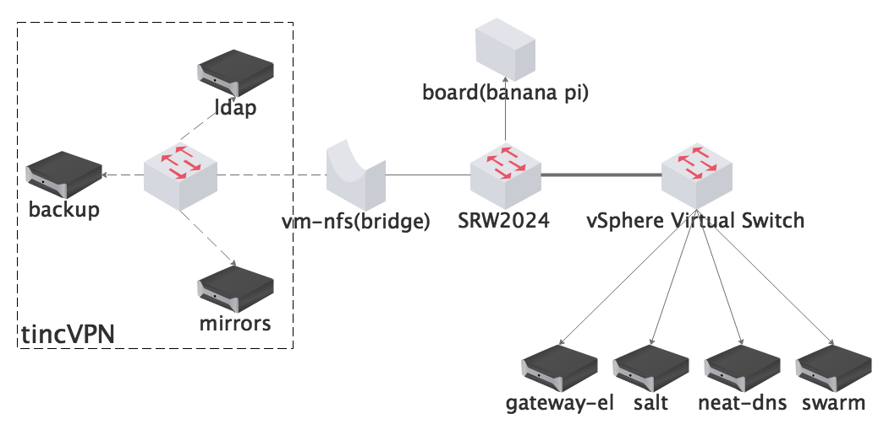

# LUG Intranet VPN

service: intranet.ustclug.org

server: board.s.ustclug.org

## Introduction



Server intranet is a closed network. Users cannot access the network from Internet.  LUGI VPN helps maintainer get access to intranet temporarily.

LUGI VPN is running in Banana Pi, the only ARM architecture device we owned. Using OpenVPN protocal, authorizing via LDAP.

## Configuration

OpenVPN LDAP auth plugin config `/etc/openvpn/auth-ldap.conf`:

```
<LDAP>
	URL             ldaps://ldap.ustclug.org
	Timeout         15
	FollowReferrals yes
	TLSCACertFile   /etc/ldap/ssl/slapd-ca-cert.pem
</LDAP>

<Authorization>
	BaseDN          "ou=people,dc=lug,dc=ustc,dc=edu,dc=cn"
	SearchFilter    "(uid=%u)"
	RequireGroup    false
</Authorization>
```

In openvpn configuration:

```
...
plugin /usr/lib/openvpn/openvpn-auth-ldap.so /etc/openvpn/auth-ldap.conf
```

